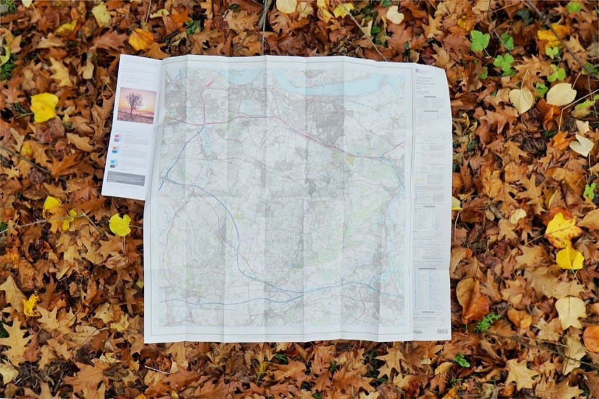

# Art of Noticing

 At least once a week for the next four weeks, revisit one of the sites you chose in the first small exercise where you identified public components of networked infrastructure (for at least 20 minutes per visit). If you would like to choose a new site to revisit that is also acceptable but make sure to write an initial blurb about your reason for choosing the site and what is drawing you to it. 
 

 This time the goal will be to practice the 'art of noticing,' focusing on the piece of internet infrastructure and creatively document what you notice. This documentation could be in the form of a field guide, audio field recording, journal or any other method you'd like. This does not need to be an intervention as much as it is for you to really spend time noticing and creatively recording what you notice.
    

For example, in a previous version of this exercise the artist Marina Zurkow would travel to Newtown Creek  audio and document the various non-human species in the area. This work eventually turned into the [Newtown Creek Field Guide](http://o-matic.com/fsde/newtown1.html).

Take note of the location of each observation in some way and make some brief notes as to what you notice about it and about yourself. Try to imagine the world from the perspective and temporality of your chosen piece of internet infrastructure, what dynamics it brings to the area, and if other non-human actors interact with it. Do some research of it history and how it has come to be here in the city with you. What are the opportunities and challenges it faces?

 During **March 9th's** class we will spend the first hour presenting the documentation and observations you all have done. 

I highly recommend reading Rob Walker's piece [How To Pay Attention](https://medium.com/re-form/how-to-pay-attention-4751adb53cb6) and Jenny Odell's essay [How to do nothing](https://medium.com/@the_jennitaur/how-to-do-nothing-57e100f59bbb) to give you some guidance for methodologies and patience needed to practice the art of noticing.