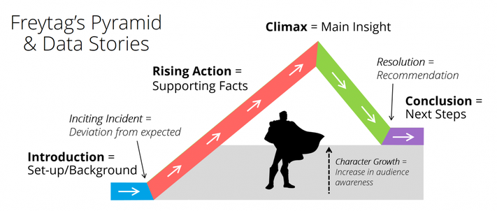

# Project 2 Data Storytelling 
## Due By: 11:59pm Tuesday April 12th.

> " In order to successfully participate in this emerging digital reality, it’s imperative that [those] internet users have the skill of digital literacy. If we don’t highlight the importance of knowing and understanding our devices and how they interact with our data, we’re in danger of creating and reproducing inequalities and privileging some people with greater access and abilities than others." - Mimi Onuoha, 2015

## Background
Up to this point in the course we have looked at a variety of mapping projects which explored how creative data processing pipelines could lead to intriguing geographic applications and spatial reimaginings. These projects have varied in topic and scope but there is one common thread through all of them - Storytelling. The stories they tell and the way they tell them has a massive impact on the way the are experienced after release. For the this project we are going to focus on the storytelling aspect of web mapping and data visualization.

You've experimented with a few mapping tools and over the next few week's we will be exploring some more generalized data vizualization tools to compliment those mapping tools. By combining both web mapping tools and tools like [datawrapper](https://datawrapper.de/) a more complete picture can be formed from the data you are interested in!

The point of this project is in part for you to create a well rounded data story using multiple tools and research methods but it is alos to show that that there is no one right tool to get the job done. Rather for this work to be completed, realizing that an assemblage of tools, some of which are more relevant than others depending on the context are necessary. The more time you spend mapping, you'll develop the ability to choose the right tools for your project needs. Like any creative work you do, it is natural to start with what makes sense/feels right to you and work towards developing new skills.

We will take the next few weeks to explore some of our own creative data processes and visualization methods to continue our mapping practice and visualization practice.

## Brief
The goal of this project is to create a compelling data story using a few different tools and data processing methods that speak to the topics we have discussed in class.

You're free to explore the directions that are most exciting to you within the guidelines below. I will also be adding in some additional boilerplate code templates for web maps and data visualiztions which you can then create a web page from if you would like.

## Step-by-Step
### NOTE Steps 1 and 2 will probably end up being done synchronously
* Step 1: Finding your story! (Researching and preparing)
    * Figure out what the story you want to tell is and create a plan for visualizing that story.
        * This could mean outlining and finding reference materials.
    * Outline the narrative of your story or if your going to be learning about your data while you're creating your narrative you can begin to ask questions and look at points of inquiry into your datasets!
    * Look up best data visualization and storytelling practices and see how that could relate to any data you are interested in using!
    * [DSLA GUIDE](https://ctil.iu.edu/projects/dsla/docs/knowledgeobjects/datastorytelling/) is a great introductory overview.
    * A lot of this will be covered in our class but still its best to review in your spare time.
* Step 2: Get the data
    * Using one of the resources below, or one of your choosing, search for a publically available dataset that interests you.
    * Do any cleaning or geoprocessing that needs to be done in order for that data to be ready to map.
    * This can be done in turf.js or another geoprocessing tool 
        * __NOTE: If you have to do any data processing my recommendation is to first try yourself but I am also available to assist!__
    * __MAKE SURE TO ONLY USE .GEOJSON DATA FOR LEAFLET, NOT .CSV OR REGULAR .JSON__
* Step 3: Assess the data you have and what you want to achieve with it.
    * It is important to think about what you want your data to say, or not to say.
    * The type of map you choose will affect how the data is read and understood
    * If you are choosing a map where color is a key factor think about how colors matter in representing data. This is also important for making sure data visualizations are clear for the visually impaired.
* Step 4: Visualize the data using Datawrapper or d3.js
    *  Choose the chart type that you think will best represent the data and help you to tell the story.
    * Both Datawrapper and d3 have extensive reference libraries and tutorials for creating graphs.
    * Datawrapper academy for instance: https://academy.datawrapper.de/
* Step 5: Map the data 
    * Using any of the tools covered so far in the semester, map the data in a way that compliments the graphs you made.
    * Feel free to use any tool from this semester including datawrapper, d3 and mapbox.
    * Make sure that your map aligns with the data you are using.
* Step 6: Iterate on your visualizations and maps.
    * Ask yourself if the story or question of inquiry you've analyzed is answered or at least being unpacked well enough by the visualizations you've created!
* Step 7: Add all components to a web page along with your analysis and "story".
    * Either using the boilerplate created for you or choosing your own style create a web page that has all of your visualizations and the story of what you're telling.
* Step 8: Reflect on the experience and what you found most beneficial about the project.

### Link to the boilerplage html templae and CSS file are located here:

## Project Write Up and Submission

Submission Link: [https://forms.gle/1XrGDEWKerD7DcrJ9](https://forms.gle/kccLRJCHBrE1XckZ6)

**Your final submission should be one integrated collection, with all components synthesized and contextualized.**

Make sure to document your process as you find and clean/convert data, visualize it, and add interaction to it. Justify your reason for creating the type of visualization you chose (points, chloropleth, heat map etc.) and why the data you mapped was interesting to you. Detail the technical steps you took to go from purely being interested in a topic to having a full fledged map of it.

Add screenshots of your maps/charts and any other assets which may help me to get a feel for your work.

In your write up please make sure to link 
1. All javascript, html, css, and data files you used.
2. Locations you pulled data from.
3. Any external resources you used.

Please make sure to zip all associated data and programming files and add them into a shared folder with your project write up. Then give me access to that link in your submission.

## Resources
* Data Tools
    * [Datawrapper](https://www.datawrapper.de/)
    * [Chloropleth Maps with Datawrappere](https://blog.datawrapper.de/choroplethmaps/)
    * [More Chloropleth Maps with Datawrapper](https://blog.datawrapper.de/weekly-chart-europegrowth/)
* Data Sources
    * [Library of Congress](https://www.loc.gov/)
* Inspiration
    * [Hans Hacke](https://www.hanshack.com/)
    * [Brian House - Eyeo 2018](https://vimeo.com/287093394)
    * [Mimi Onuohoa - Eyeo 2018](https://vimeo.com/233011125)
    * [Storytelling with Data | Cole Nussbaumer Knaflic](https://www.youtube.com/watch?v=8EMW7io4rSI)
    * [Out of Sight, Out of Mind](http://drones.pitchinteractive.com/)
    * [NYT Covid Tracker](https://www.nytimes.com/interactive/2020/world/coronavirus-maps.html)
    * [BBC: How Much Warmer is Your City](https://www.bbc.co.uk/news/resources/idt-985b9374-596e-4ae6-aa04-7fbcae4cb7ee)
    * [The Guardian: Bussed Out](https://www.theguardian.com/us-news/ng-interactive/2017/dec/20/bussed-out-america-moves-homeless-people-country-study)