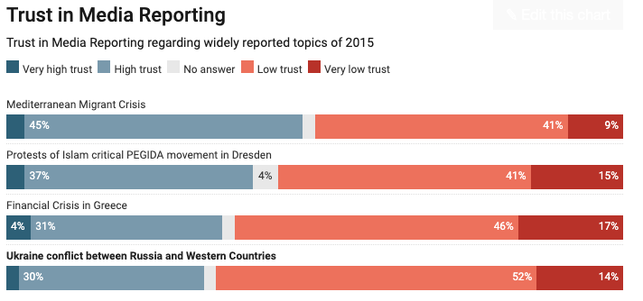
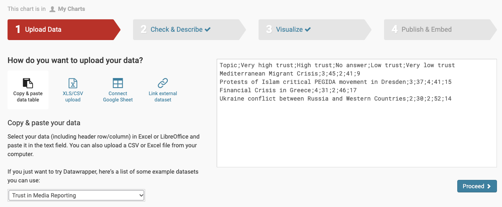
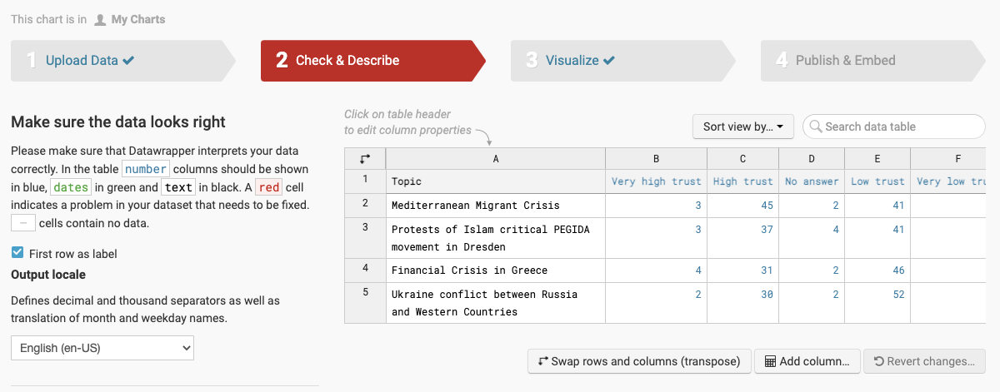
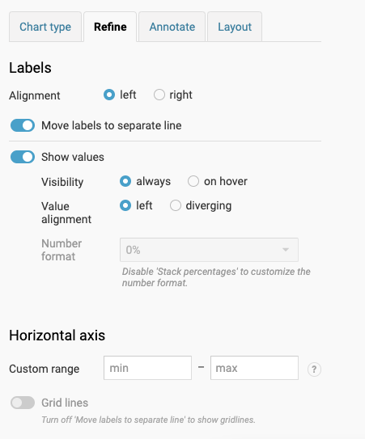
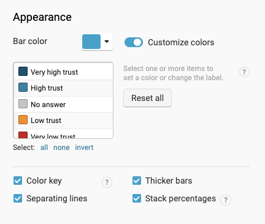
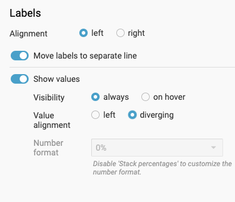
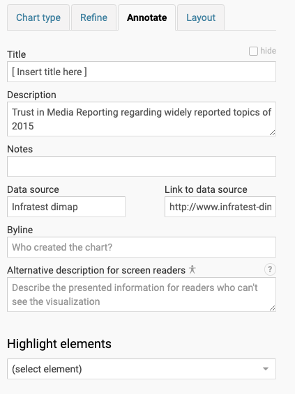
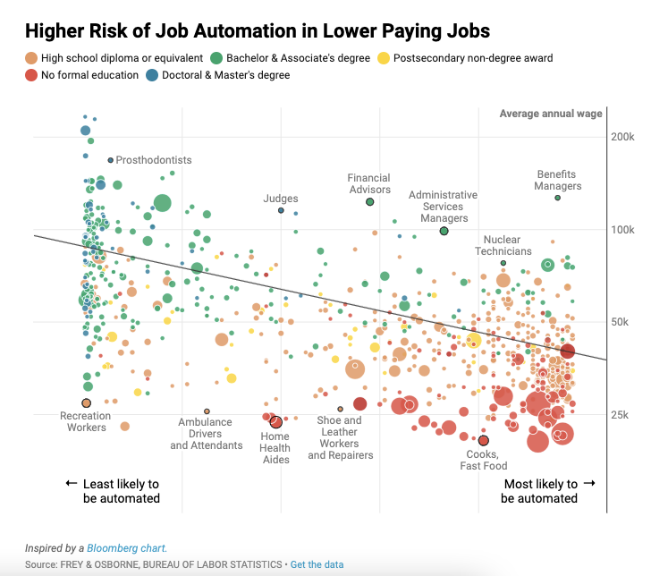
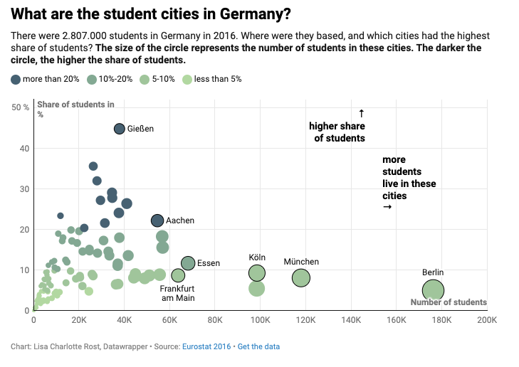
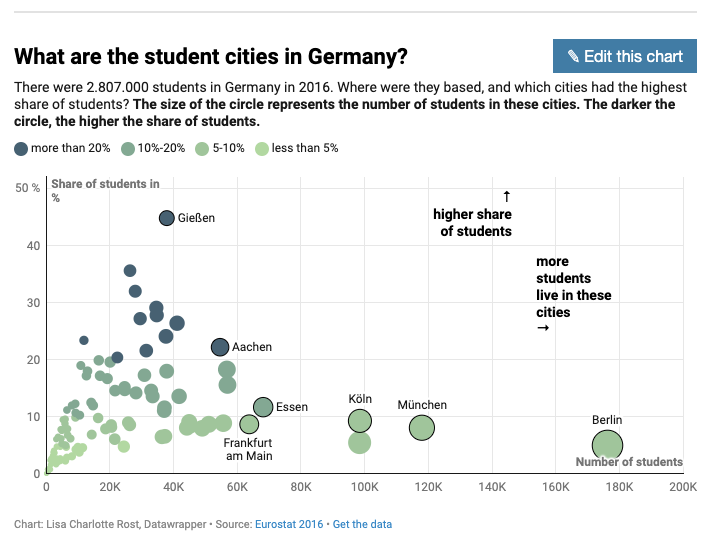

# Week 9 Studio
### Working With Datawrapper and prepping for project 2

## About
[Datawrapper](https://datawrapper.de/) is an online tool with which you can create charts, maps and tables for web and print. It is a powerful tool for data visualization that will most likely be something you use in your second project.

## Before You Start
I highly recommend that you familiarize yourself with the extensive features available in Datawrapper. To do so you could review the [datawrapper Academy page](https://academy.datawrapper.de/) on their website or just google around. The company has extensive training materials so if you have an idea of what you want to do but are unsure of exactly how to get there a quick google should help!

## Visualization 1: Stacked Bar Chart

To begin make sure that you have datawrapper opened and are in menu titled dashboard or "start creating". Then click "Create New Chart"  

1. Next, under the upload data tab scroll to the bottom left where it shows you to choose a sample dataset. In that dropdown choose the "Trust in Media Reporting" option. Once you selected “Trust in Media Reporting”, you see the dataset in the text field. It looks a bit chaotic right now, but don’t worry, it’ll be tidied up and readable once we go to the next step, Check & Describe. 

Click the "Check & Desrcibe" tab to move on.

2. Now we see our data in a proper table! Let’s look at the data we just selected. 

In the first column, we see media topics, like “the financial crisis in Greece” or the “Ukraine Conflict”. The following columns contain values for “Very high trust”, “high trust” etc. It seems to be a poll, where people could reply how much they trusted the media reporting on the topics we see. 

You can see that the columns are differently colored. The first column is black – that tells us that Datawrapper recognizes this column as a text column. Great! That’s what it is. The following columns are blue, which means Datawrapper thinks these are columns filled with numbers. That’s also right, so it seems like we’re good to go. 

When you’re creating a data visualization, it’s always helpful to know if Datawrapper understands the values you uploaded. Make sure the columns are in the right color before continuing. 

Ok, let’s do that; let’s continue. Click on “Proceed” in the lower left to go to step 3: “Visualize”.

3. Now under the visualize tab leave the chart type as "Stacked bar" and choose the "Refine" option.

4. This brings us to a page on which we have different settings. 

Play around with them! 

You can turn “Thicker bars” off, for example, or see what happens when you turn on “Show values on hover”. 

When you’re ready to change the colors, click on “customize colors” right below “Appearance”. 
This will open a little list of categories that we can color differently. 

Click on each category then click on the little color rectangle that appears to its right. Now you can select a color and then check the little check mark in the lower right. 

Which color settings do you think communicate the data well? 

5. To increase the visual difference between the positive and the negative values, 
we can also use a “diverging” value alignment. 

Try it out and see if you prefer that over the left alignment. 

6. Now the chart looks good, but it needs a proper title. 

To add one, go to the “Annotate” tab. Here you can add:

- a title. 
- a description, 
- a data source, 
- a byline, 
- and a description of your chart for visually impaired readers.

Almost everything is already filled out. To give the chart a title, click in the first text field and start typing. 
The description already tells us what kind of data we see in the chart; so we can use the title to communicate what we can read out of this chart. 

7. Try a few different chart types with this data now! Datawrapper saves the settings so you can always go back to the stacked bars later. 

I would recommend trying the multiple donuts out and seeing how those look!

## Visualization 2: Recreate an example chart in datawrapper

Using one of the two links below choose one of the visualizations in them to recreate. Recretating visualizations is one of the best way to figure out the ins and outs of any tool so try to think through the reasoning behind the original chart/map designer's choices.

* [Scatterplot Examples](https://academy.datawrapper.de/article/148-examples-of-datawrapper-scatter-plots)
* [Chloropleth Map Examples](https://academy.datawrapper.de/article/149-examples-of-datawrapper-choropleth-maps)

If you have trouble finding  chart which seems interesting I would recommend trying to recreate this scatterplot:

located here: [link](https://academy.datawrapper.de/article/148-examples-of-datawrapper-scatter-plots)

1. To do so first look at the footer of the visualization you'd like to recreate and click the "get the data" section. This will download the necessary data onto your computer. 

2. From there open a new datawrapper tab and upload the data.

3. in the original example's page hover over the visualization and when a pop-up saying "edit this chart" appears click it! That will take you to a datawrapper page which has all of the choices saved in it.

4. In your separate datawrapper page try to recreate the viz while using the original as minimally as possible.

## Final Section: 

Spend the rest of the studio time researching and testing out potentinal data sets of interest, for your project, in datawrapper.

Come see me for any issues or questions!
